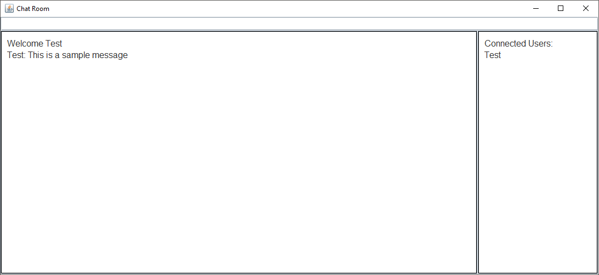
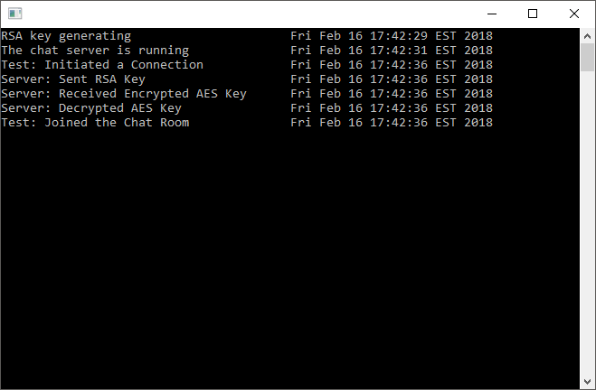

# Encrypted-Chat-Application

This project involves a client/server chat room with end to end encryption and basic logging. The server generates an RSA key upon startup. As each client successfully connects, the server will send it's public RSA key to the client. The client then creates an AES key, encrypts it with the server's public key and sends it to the server. The server then decrypts this key and stores it. As each client sends a message, the server will decrypt the message with the senders AES key and send it to every client using each users individual AES key.

### Client



### Server


## Installation
Client: Edit the ip address the client will be connecting to. This is the ip address of the server
ex.
```sh
final String serverAddress = "xxxxxxxxxxx";

final String serverAddress = "192.168.1.1";
```
Server: Requires no setup unless the clients are over a public network. In this case port 9001 TCP must be open on the server's network.

## Release History
* 1.0.0
  * First release
  
## Author
* Greg Williams
